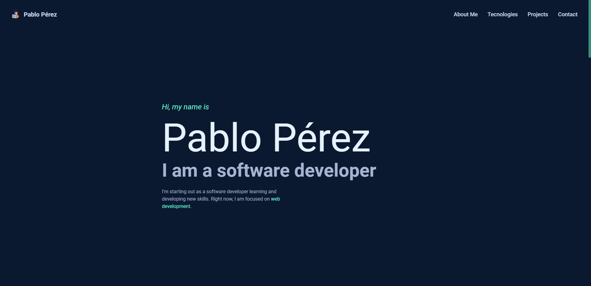

<h1 align="center">:cyclone: yaoming16.github.io :cyclone:</h1>

This is the second version of <a href="https://yaoming16.github.io">my personal page</a>

<h2>:cyclone: Acknowledgements<h2/>

The design of the page was inspired by <a href="https://brittanychiang.com/">Brittany Chiang</a>, particularly the color palette and the projects section.
  
All the code was written by me using:
<ul>
  <li><a href="https://tailwindcss.com/">Tailwind</a></li>
  <li><a href="https://es.reactjs.org/">React</a> </li>
  <li><a href="https://flowbite-react.com/">Flowbite</a> </li>
  <li><a href="https://vitejs.dev/">Vite</a></li>
  <li><a href="https://code.visualstudio.com/">VSCode</a></li>
</ul>

